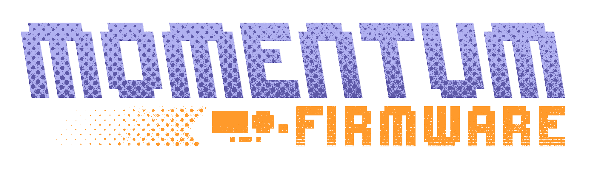
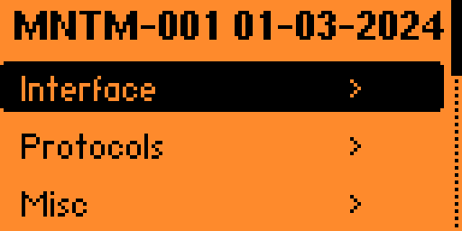
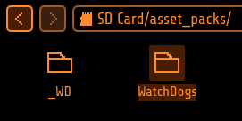
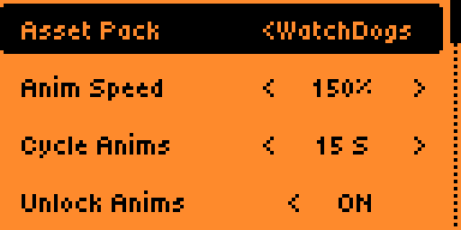
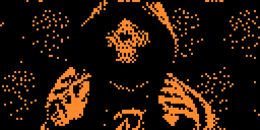
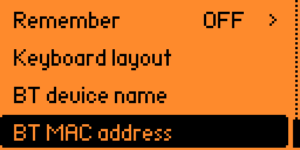

<p align="center">
  
  <h2 align="center">for Flipper Zero</h2>
</p>

<h2 align="center">
  <a href="#Install">Install</a> | <a href="#list-of-changes">Features</a> | <a href="https://discord.gg/momentum">Discord</a> | <a href="#%EF%B8%8F-support">Donate</a>
</h2>

This custom firmware is based on the [Official Firmware](https://github.com/flipperdevices/flipperzero-firmware), and includes most of the awesome features from [Unleashed](https://github.com/DarkFlippers/unleashed-firmware). It is a direct continuation of the Xtreme firmware, built by the same (and only) developers who made that project special.

-----
<br>
<h2 align="center">Modus Operandi:</h2>

The goal of this firmware is to constantly push the bounds of what is possible with Flipper Zero, driving the innovation of many new groundbreaking features, while maintaining the easiest and most customizable user experience of any firmware. Fixing bugs promptly and ensuring a stable and compatible system is also of our utmost importance.
<br><br>
- <h4>Feature-rich: We include all third-party features and apps as long as they fulfill a useful purpose and they work correctly, aswell as implement ourselves many new exciting functionalities.</h4>

- <h4>Stable: We ensure the most stable experience possible by having an actual understanding of what's going on, and proactively making all tweaks and additions backwards-, and inter-, compatible.</h4>

- <h4>Customizable: You can tweak just about everything you see: add/remove apps from the menu, change the animations, replace icon graphics, change your Flipper's name, change how the main menu looks, setup different keybinds like never before, and so much more. All on-device, with no complicated configuration.</h4>
<br><br>
Note that mentioned below are only a few of our staple additions to the firmware. For a full list check [down here](https://github.com/Next-Flip/Momentum-Firmware#List-of-Changes).

-----
<br>
<h2 align="center">Momentum Settings:</h2>

We offer a powerful and easy-to-use application tailor-made for our firmware, that lets you configure everything you could dream of, and more:




- <ins><b>Interface:</b></ins> Tweak every part of your Flipper, from the desktop animations, to the main menu, lockscreen behavior, file browser, etc.

- <ins><b>Protocols:</b></ins> Configure SubGhz settings, add/remove custom frequencies, extend SubGhz frequencies to 281-361, 378-481, 749-962 MHz and setup which GPIO pins are used by different external modules.

- <ins><b>Misc:</b></ins> Everything else that doesn't fit the previous categories. Change your Flipper's name, XP level, screen options, and configure the <a href="https://github.com/Z3BRO/Flipper-Zero-RGB-Backlight">RGB backlight</a>.

<br>

-----
<br>
<h2 align="center">Animations / Asset Packs:</h2>

We created our own improved Animation / Asset system that lets you create and cycle through your own `Asset Packs` with only a few button presses, allowing you to easily load custom Animations, Icons and Fonts like never before. Think of it as a Theme system that's never been easier.


You can easily create your own pack, or find some community-made ones on <b><a href="https://momentum-fw.dev/asset-packs">our website</a> or on Discord</b>. Check <a href="https://github.com/Next-Flip/Momentum-Firmware/blob/dev/documentation/file_formats/AssetPacks.md">here</a> for a tutorial on creating your own. Essentially, each <code>Asset Pack</code> can configure its own <code>Anims</code>, <code>Icons</code> & <code>Fonts</code>.

<br clear="left"/>

<br>


Once you have some asset packs, upload them to your Flipper in <code>SD/asset_packs</code> (if you did this right you should see <code>SD/asset_packs/PackName/Anims</code> and/or <code>SD/asset_packs/PackName/Icons</code>). Alternatively, install directly using the website.


<br clear="left"/>

<br>


After installing the packs to Flipper, hit the <code>Arrow Up</code> button on the main menu and go to <code>Momentum Settings > Interface > Graphics</code>. Here choose which asset pack you want and tweak the other settings how you prefer, then exit the app to reboot and enjoy your fully customized Flipper!

<br clear="left"/>

-----
<br>
<h2 align="center">Bad Keyboard:</h2>


BadUSB is a great app, but it lacks Bluetooth connectivity. Bad-KB allows you to toggle between USB and Bluetooth mode for your attacks.

In Bluetooth mode it allows you to spoof the display name and MAC address of the device to whatever you want. Showing up as a portable speaker or a wireless keyboard is easily doable, allowing you to get the attention of your target without needing a cable at hand.

In USB mode it also enables additional functionality to spoof the manufacturer and product names, as well as vendor and product IDs (VID/PID).

-----
<br>
<h2 align="center">List of changes:</h2>

There are too many to name them all, this is a **non-comprehensive** list of the **most notable from an end-user perspective**. For a more detailed list, you can read through the [**changelogs**](https://github.com/Next-Flip/Momentum-Firmware/releases) and commits/code. Also, you can find a **feature comparison with other firmwares** on [our website](https://momentum-fw.dev/#features).

Note that this repo is always updated with the great work from our friends at [Unleashed](https://github.com/DarkFlippers/unleashed-firmware) and the latest changes from [OFW](https://github.com/flipperdevices/flipperzero-firmware). Below are mentioned only **our** changes that we can actually be credited for, so make sure to check their fantastic additions aswell. And a huge thank you to both teams!

```txt
[Added]

- Momentum App (Easy configuration of features and behavior of the firmware)
- Asset Packs (Unparalleled theming and customization)
- More UI customization, redesigns and optimizations
- Bad-Keyboard App
- BLE Spam App
- FindMy Flipper App
- NFC Maker App
- Wardriver App
- File Search across SD Card
- Additional NFC parsers and protocols
- Subdriving (saving GPS coordinates for Sub-GHz)
- Easy spoofing (Name, MAC address, Serial number)
- Video Game Module color configuration right from Flipper
- Enhanced RGB Backlight modes (Full customization & Rainbow mode)
- File management on device (Cut, Copy, Paste, Show, New Dir, etc.)
- Remember Infrared GPIO settings and add IR Blaster support in apps
- Advanced Security measures (Lock on Boot, reset on false pins, etc.)
- Disk Image management (Mount and view image contents, open in Mass Storage)
- Extended JavaScript API (Support for UsbDisk/Mass Storage, File operations)
```
```txt
[Updated]

- Enhanced WiFi support for easiest setup ever
- Extended keyboard with cursor movement and symbols
- File Browser with Sorting, More supported File Types
- Advanced and optimized Level System (Up to 30 levels)
- Desktop Keybind system for full key and press/hold remapping
- Storage backend with instant rename and virtual mounting for disk images
- Weather Station, POCSAG, TPMS protocols and more integrated into Sub-GHz
- Expanded Sub-GHz App (Duplicate detection & Ignore, Autosave, History improvements)
- Improved Error Messages (Showing source file paths)
```
```txt
[Removed]

- Unused Dummy Mode
- Broken or Superfluous apps
```

----
<br>
<h2 align="center">Install:</h2>
<br>

There are 4 methods to install Momentum, we recommend you use the **Web Updater**, but choose whichever one you prefer:

<br>

> <details><summary><code>Web Updater (Chrome)</code></summary><ul>
>   <li>Make sure qFlipper is closed</li>
>   <li>Open the <a href="https://momentum-fw.dev/update">Web Updater</a></li>
>   <li>Click <code>Connect</code> and select your Flipper from the list</li>
>   <li>Click <code>Flash</code> and wait for the update to complete</li>
> </ul></details>

> <details><summary><code>Flipper Lab/App (chrome/mobile)</code></summary><ul>
>   <li>(Desktop) Make sure qFlipper is closed</li>
>   <li>(Mobile) Make sure you have the <a href="https://docs.flipper.net/mobile-app">Flipper Mobile App</a> installed and paired</li>
>   <li>Open the <a href="https://github.com/Next-Flip/Momentum-Firmware/releases/latest">latest release page</a></li>
>   <li>Click the <code>☁️ Flipper Lab/App (chrome/mobile)</code> link</li>
>   <li>(Desktop) Click <code>Connect</code> and select your Flipper from the list</li>
>   <li>(Desktop) Click <code>Install</code> and wait for the update to complete</li>
>   <li>(Mobile) Accept the prompt to open the link in the Flipper Mobile App</li>
>   <li>(Mobile) Confirm to proceed with the install and wait for the update to complete</li>
> </ul></details>

> <details><summary><code>qFlipper Package (.tgz)</code></summary><ul>
>   <li>Download the qFlipper package (.tgz) from the <a href="https://github.com/Next-Flip/Momentum-Firmware/releases/latest">latest release page</a></li>
>   <li>Make sure the <code>WebUpdater</code> and <code>lab.flipper.net</code> are closed</li>
>   <li>Open <a href="https://flipperzero.one/update">qFlipper</a> and connect your Flipper</li>
>   <li>Click <code>Install from file</code></li>
>   <li>Select the .tgz you downloaded and wait for the update to complete</li>
> </ul></details>

> <details><summary><code>Zipped Archive (.zip)</code></summary><ul>
>   <li>Download the zipped archive (.zip) from the <a href="https://github.com/Next-Flip/Momentum-Firmware/releases/latest">latest release page</a></li>
>   <li>Extract the archive. This is now your new Firmware folder</li>
>   <li>Open <a href="https://flipperzero.one/update">qFlipper</a>, head to <code>SD/update</code> and simply move the firmware folder there</li>
>   <li>On the Flipper, hit the <code>Arrow Down</code> button, this will get you to the file menu. In there simply search for your updates folder</li>
>   <li>Inside that folder, select the Firmware you just moved onto it, and run the file thats simply called <code>Update</code></li>
> </ul></details>

<br>

----
<br>
<h2 align="center">Build it yourself:</h2>

```bash
To download the repository:
$ git clone --recursive --jobs 8 https://github.com/Next-Flip/Momentum-Firmware.git
$ cd Momentum-Firmware/

To flash directly to the Flipper (Needs to be connected via USB, qFlipper closed)
$ ./fbt flash_usb_full

To compile a TGZ package
$ ./fbt updater_package

To build and launch a single app:
$ ./fbt launch APPSRC=your_appid
```

----
<h2 align="center">Stargazers over time</h2>

[](https://starchart.cc/Next-Flip/Momentum-Firmware)

<!-- ----
<h2 align="center">Contributors</h2>

[](https://github.com/Next-Flip/Momentum-Firmware/graphs/contributors) -->


## ❤️ Support
If you enjoy the firmware please __**spread the word!**__ And if you really love it, maybe consider donating to the team? :D

> **[Ko-fi](https://ko-fi.com/willyjl)**: One-off or Recurring, No signup required

> **[PayPal](https://paypal.me/willyjl1)**: One-off, Signup required

> **BTC**: `1EnCi1HF8Jw6m2dWSUwHLbCRbVBCQSyDKm`

**Thank you <3**
